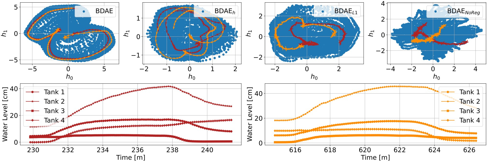

# CBDAE
### Repository for Contrastive Blind Denoising Autoencoder for Real Time Denoising of Industrial IoT Sensor Data

This is a data-driven technique for data cleaning to be used in control applications

- Denoising results in synthetic data

- Denoising results in real industrial data

- Smooth latent space produced by the NCE regularization 

